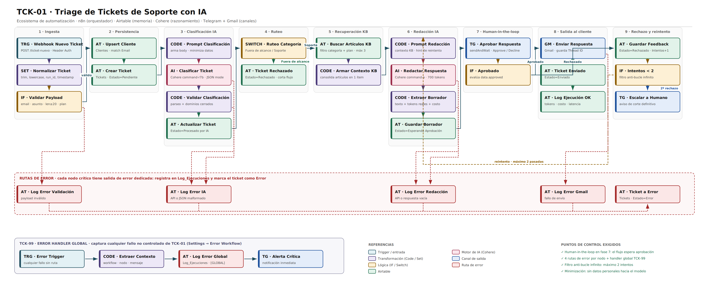

# Ecosistema de Automatización IA Autónomo · Triage de Tickets de Soporte

Entrega Final del curso de Automatización e IA. Sistema que resuelve de extremo a extremo el triage y la respuesta de tickets de soporte para **NimbusCRM**, un SaaS de gestión de contactos, con un punto de validación humana antes de contactar al cliente.



---

## Enlaces obligatorios

| Recurso                               | Enlace                                                   |
| ------------------------------------- | -------------------------------------------------------- |
| Base de datos Airtable (modo lectura) | https://airtable.com/app6VZNu6Sf0z8moD/shrwGB7MMp4VjjZk0 |
| Documento de la entrega               | [docs/Entrega_Final.pdf](docs/Entrega_Final.pdf)         |

---

## Qué hace el sistema

Un formulario web dispara un webhook. El sistema:

1. Normaliza y valida el payload recibido
2. Persiste al cliente (upsert por email) y crea el ticket en Airtable
3. Clasifica la consulta con un modelo de lenguaje: categoría, prioridad, sentimiento, resumen y confianza
4. Descarta lo que no es soporte antes de gastar el modelo grande
5. Recupera hasta 3 artículos de la base de conocimiento, filtrados por categoría y plan contratado
6. Redacta la respuesta con un segundo modelo, restringido a esos artículos
7. **Solicita aprobación humana por Telegram y suspende la ejecución**
8. Si el revisor aprueba, envía el correo por Gmail y registra tokens, costo y latencia
9. Si rechaza, reintenta una vez con otro enfoque y luego escala a un humano

Sin intervención manual en ningún punto salvo el paso 7, que es deliberado.

---

## Stack

| Categoría        | Implementación     | Rol                                                   |
| ---------------- | ------------------ | ----------------------------------------------------- |
| Orquestador      | n8n Cloud          | Lógica, ruteo y gestión de errores                    |
| Base de datos    | Airtable           | Memoria, máquina de estados y telemetría              |
| Procesamiento IA | Cohere Chat API v2 | Clasificación estructurada y redacción sobre contexto |
| Canal de salida  | Gmail              | Respuesta al cliente final                            |
| Canal interno    | Telegram           | Aprobación humana y alertas de error                  |

**30 nodos** en el workflow principal + **4 nodos** en el workflow de captura global de errores.

## Modelo de datos

Cuatro tablas vinculadas en la base `Mesa de Ayuda IA`. **Tickets** es la tabla central.

```
Clientes ──1:N──> Tickets <──N:N──> Base_Conocimiento
                     │
                    1:N
                     v
              Log_Ejecuciones
```

| Tabla               | Rol                                                                       |
| ------------------- | ------------------------------------------------------------------------- |
| `Clientes`          | Identidad del solicitante, deduplicada por email                          |
| `Base_Conocimiento` | Fuente de verdad para la redacción, con planes aplicables por artículo    |
| `Tickets`           | Tabla central y máquina de estados de 6 valores                           |
| `Log_Ejecuciones`   | Telemetría: resultado, modelo, tokens, costo, latencia y mensaje de error |

Esquema completo en [`schemas/06_airtable_esquema.json`](schemas/06_airtable_esquema.json).

### Máquina de estados

```
Pendiente → Procesado por IA → Esperando Aprobación → Enviado
Pendiente → Procesado por IA → Rechazado                        (fuera de alcance)
Esperando Aprobación → Rechazado → Esperando Aprobación         (reintento, 1 vez)
cualquier estado → Error                                        (validación / API / envío)
```

---

## Optimización de costos

Cada tarea usa el modelo más barato capaz de resolverla.

| Tarea                     | Modelo        | Por qué                                                                 |
| ------------------------- | ------------- | ----------------------------------------------------------------------- |
| Clasificación             | Command R7B   | Dominios cerrados, salida de 5 campos, sin razonamiento de varios pasos |
| Redacción                 | Command A     | Lee 3 artículos completos y debe sostener tono y restricciones          |
| Reprocesamiento histórico | Batch / lotes | Sin urgencia, permite tarifas de volumen (no aplica al flujo en vivo)   |

| Escenario                               | Ahorro     |
| --------------------------------------- | ---------- |
| Por ticket procesado completo           | **38,6 %** |
| 1.000 tickets con 15 % fuera de alcance | **47,7 %** |

El segundo escenario suma el descarte temprano: un mensaje que no es soporte nunca llega al modelo caro. Cálculo detallado en la sección 3 del PDF.

---

## Seguridad y resiliencia

**Minimización de datos.** Al proveedor de IA solo se envían asunto, descripción y plan. Nombre, email y empresa nunca salen. La personalización se inyecta después del modelo, en el nodo de Gmail.

**Rutas de error.** Seis nodos críticos tienen salida de error dedicada. Ninguna falla se pierde en silencio: todas quedan en `Log_Ejecuciones` y dejan el ticket en un estado consultable.

| Nodo                           | Modo de falla                              |
| ------------------------------ | ------------------------------------------ |
| `IF · Validar Payload`         | Payload incompleto o mal formado           |
| `AI · Clasificar Ticket`       | API caída, clave inválida, límite de tasa  |
| `CODE · Validar Clasificación` | JSON no parseable o valor fuera de dominio |
| `AI · Redactar Respuesta`      | API caída o límite de tasa                 |
| `CODE · Extraer Borrador`      | Respuesta vacía del modelo                 |
| `GM · Enviar Respuesta`        | Fallo de envío o token expirado            |

**Captura global.** `TCK-99` se dispara ante cualquier fallo no contemplado, lo registra con prefijo `[GLOBAL]` y alerta por Telegram. Cobertura en dos niveles: por nodo y global.

**Filtro anti-bucle.** El campo `Intentos IA` se incrementa en cada rechazo y `IF · Intentos < 2` corta el ciclo en el segundo. Techo duro, independiente del modelo y del revisor.

**Human-in-the-loop.** La operación `sendAndWait` de Telegram suspende la ejecución hasta 24 horas. Ninguna respuesta generada llega a un cliente sin que una persona la haya leído.

---

## Reproducir el sistema

### 1. Base de Airtable

Crear la base `Mesa de Ayuda IA` con las cuatro tablas según [`schemas/06_airtable_esquema.json`](schemas/06_airtable_esquema.json) e importar [`data/base_conocimiento.csv`](data/base_conocimiento.csv) en `Base_Conocimiento`.

### 2. Importar los workflows

En n8n: **Import from File** para cada JSON de `flows/`.

### 3. Credenciales

| Credencial               | Nodos | Cómo obtenerla                                                                            |
| ------------------------ | ----- | ----------------------------------------------------------------------------------------- |
| Header Auth (webhook)    | 1     | `openssl rand -hex 32`                                                                    |
| Airtable PAT             | 14    | `airtable.com/create/tokens`, scopes de registros y esquema, alcance limitado a esta base |
| Cohere API (Header Auth) | 2     | `Authorization: Bearer <API_KEY>`                                                         |
| Telegram Bot             | 3     | `@BotFather` → `/newbot`                                                                  |
| Gmail OAuth2             | 1     | Asistente de n8n                                                                          |

El chat ID de Telegram se obtiene escribiéndole al bot y consultando `getUpdates`.

### 4. Ajustes finales

- Reemplazar `TU_CHAT_ID` en los tres nodos de Telegram
- Ajustar `PRECIO_IN_POR_M` y `PRECIO_OUT_POR_M` en `CODE · Extraer Borrador`
- En `TCK-01`: **Settings → Error Workflow → TCK-99**
- Activar ambos workflows

### 5. Disparar

```bash
curl -X POST "https://arbulujavs.app.n8n.cloud/webhook/ticket-nuevo" \
  -H "Content-Type: application/json" \
  -H "x-api-key: TU_CLAVE" \
  -d '{
    "nombre": "Laura Méndez",
    "email": "laura.mendez@vertexlab.pe",
    "empresa": "Vertex Lab",
    "plan": "Enterprise",
    "asunto": "La sincronización de contactos quedó a medias",
    "descripcion": "Corrimos la sincronización anoche y de 4.200 contactos solo entraron 3.100. No aparece ningún mensaje de error en pantalla y no sabemos qué filas quedaron afuera."
  }'
```

Contrato completo del payload en [`schemas/01_webhook_entrada.schema.json`](schemas/01_webhook_entrada.schema.json).

## Dashboard de control

Cuatro vistas compartidas de Airtable, en modo lectura y sin contraseña. Cada una responde un indicador distinto del sistema.

| Indicador                                                                                | Fuente            | Configuración                                         | Enlace                                                     |
| ---------------------------------------------------------------------------------------- | ----------------- | ----------------------------------------------------- | ---------------------------------------------------------- |
| **Tasa de errores por nodo** — qué proporción de corridas falla y en qué punto del flujo | `Log_Ejecuciones` | Filtrada por `Resultado = Error`, agrupada por `Nodo` | `https://airtable.com/app6VZNu6Sf0z8moD/shrCH4snmUoCb9vU3` |
| **Estado operativo** — cuántos tickets hay en cada etapa y cuántos esperan aprobación    | `Tickets`         | Agrupada por `Estado`                                 | `https://airtable.com/app6VZNu6Sf0z8moD/shrzduIRwQl08pDJw` |
| **Consumo y costo** — costo acumulado, tokens totales y latencia media                   | `Log_Ejecuciones` | Filtrada por `Resultado = OK`, con sumatorias         | `https://airtable.com/app6VZNu6Sf0z8moD/shrH0Szut5DqO0pYg` |
| **Calidad del triage** — distribución de la clasificación y confianza media del modelo   | `Tickets`         | Agrupada por `Categoría`                              | `https://airtable.com/app6VZNu6Sf0z8moD/shrH0Szut5DqO0pYg` |

## Criterios de evaluación

| #   | Criterio                          | Dónde se resuelve                             |
| --- | --------------------------------- | --------------------------------------------- |
| 1   | Mapa de arquitectura              | `docs/Entrega_Final.pdf` sección 1 y página 5 |
| 2   | Estructuras de datos documentadas | Sección 2 + carpeta `schemas/`                |
| 3   | Optimización de costos            | Sección 3                                     |
| 4   | Seguridad y resiliencia           | Sección 4                                     |
| 5   | Dashboard de control              | Sección 5 + enlace público arriba             |

---

## Nota sobre credenciales

Los archivos de `flows/` no contienen credenciales: n8n las almacena por referencia. Pueden publicarse sin riesgo.

**Autor:** Javier Arbulú
